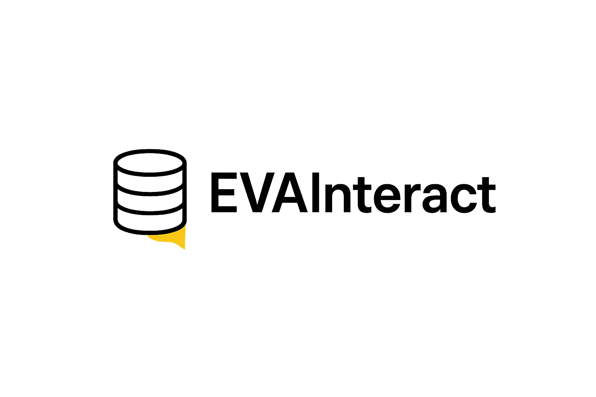

# 🤖 EVAInteract

Welcome to **EVAInteract** — an AI-powered conversational assistant that transforms the way **EVA Pharma** manages and explores **HCP interactions**.  
**Ask. Get. Decide.** — Data made simple with EVAInteract.  



---

## 🚀 What does EVAInteract do?
EVAInteract lets business users ask questions in natural language and get accurate answers from a MySQL database — **no SQL required**. It’s built for **EVA Pharma’s** CRM/ERP-style data (HCPs & interactions) and uses a grounded LLM chain to defend injections, plan, generate, validate, and explain results.

---

## 🧱 System at a Glance

### RAG Retriever — grounds the LLM in only the relevant tables/columns/joins.

### LLM Chain (5 steps) — Guard ➜ Plan ➜ Generate ➜ Validate ➜ Format.

### MySQL Database — read-only execution against July datasets.

### Streamlit UI — clean chat interface + result tables.

### Evaluation — exact match & similarity vs. ground truth.

---

## 🔍 Data & Schema (MySQL) 🛢️  

Stored in **MySQL (July data only)**:  

- `july_interactions`  
- `july_HCPs`  

---

## ⚡ Key Features  

- 💬 **Natural Conversations** — Just ask questions like *“Find all HCPs who are university staff”*.  
- 🔍 **Smart SQL Generation** — No need to write queries, EVAInteract does it for you.  
- 🛡️ **Safety First** — Guards against SQL injection & malicious prompts.  
- 📊 **Instant Insights** — Clean tables, summaries, and visualizations in Streamlit.  
- 🧪 **Evaluation Metrics** — Built-in checks for accuracy vs. ground truth queries.  

---

## 🧰 RAG Retriever (Schema Grounding)

- Retrieves only relevant tables, columns, and PK–FK relationships.
- Prevents hallucinations, ensuring alignment with real schema & business rules.
- Boosts accuracy of joins, filters, and aggregations.

---

## 🧭 Five-Step LLM Chain (Approach)

### 1. 🔒 SQL Injection Check (Guard)
- LLM Classifier + Regex/Allow-list → ensures only safe, read-only queries pass.
- Protects against unrelated or malicious injections.

### 2. 🧠 Reasoning / Planning
- Produces a structured plan of tables, joins, filters, grouping, and metrics.
- No SQL generated yet — just a safe blueprint.

### 3. ⚙️ Initial SQL Generation
- Generates MySQL-only queries under strict rules:
- No SELECT * (unless explicitly asked).
- Explicit JOINs, safe strings, schema alignment.

### 4. 🛡️ SQL Validation & Correction
- Uses sqlparse + LLM self-check + EXPLAIN.
- Fixes syntax/column issues.
- Preserves original intent while ensuring validity.

### 5. 🗣️ Natural Language Formatting
- Converts raw SQL results into human-friendly answers:
- Simple explanations.
- Clear tables & KPIs.
- Summaries with natural phrasing.

⚠️(SQL execution handled in Database Component — this section covers the LLM pipeline.)

---

## 🖥️ Streamlit UI (Chatbot) 

- Conversational chat with Show query details option.
- Displays result tables with sample rows & summaries with explanations in user-friendly language.
- Friendly error handling + “no results” messages.

---

## 📊 Evaluation

### We evaluated LLM-generated outputs against ground-truth SQL & answers using multiple metrics:
- **SQL Exact match % 🎯** → normalized query string (case/whitespace agnostic).
- **Answer Similarity** → semantic similarity between generated answers and references.
- **Latency ⏱️** → avg response time per query.

### ⚡ Models Compared
- We benchmarked end-to-end performance by running the entire chain with different LLMs:
🌟 `Gemini 2.0 Flash`
🔥 `Mistral (via Ollama)`
🧩 `Qwen Coder 2.5 (via Ollama)`

### Example Output
```json
{
        "query": "Show all consultants",
        "expected_sql": "SELECT * FROM HCP WHERE isconsultant = TRUE;",
        "generated_sql": "SELECT *\nFROM HCP\nWHERE isconsultant = TRUE;",
        "similarity": 1.0,
        "exact_match": true,
        "response_time": 3.123384714126587,
        "original_sql": "SELECT *\nFROM HCP\nWHERE isconsultant = TRUE;",
        "sql_query": "SELECT *\nFROM HCP\nWHERE isconsultant = TRUE;",
        "was_corrected": false,
        "is_valid": true,
        "security_check_passed": true
}
```

⚠️ Reasoning and Schema Context and Retrieved chunks also appears when running the evaluation.py

---

## 🚀 Tech Stack
- Frontend: Streamlit
- Backend: Python, MySQL
- LLMs: Gemini / Mistral / QwenCoder 2.5
- Evaluation: SQL exact match, semantic similarity
- Pipeline Enhancements: RAG Retriever with Chroma db, SQL Validator, Semantic Matching

---


## 🗂️ Project Structure

- RAG-SQL-for-Structured-Data-Retrieval/
  - `app.py` → Main app launcher
  - `db_executor.py` → Executes database queries
  - `eva_analytics_app.py` → Streamlit analytics interface
  - `eva_logo_y.png` → EVAPharma's logo
  - `EVAInteract_logo.png` → EVAInteract project logo
  - `EVAInteract_archi.png` → EVAInteract System Architecture
  - `EVAInteract_chain_steps.png` → EVAInteract Chain Steps
  - `evaluation.py` → Model evaluation script
  - `llm_models.py` → Loads LLM models
  - `query_chain.py` → SQL generation pipeline
  - `rag_retriever.py` → Schema-aware retriever
  - `result_formatter_llm.py` → Formats LLM results
  - `requirements.txt` → Project dependencies list
  - `README.md` → Project documentation


---

## ⚙️ Installation

```bash
# Clone the repo
git clone https://github.com/markgamall/RAG-SQL-for-Structured-Data-Retrieval.git
cd RAG-SQL-for-Structured-Data-Retrieval

# Install requirements
pip install -r requirements.txt

# Run application
streamlit run app.py

#Run Evaluation
python run evaluation.py
```

Add your environment variables in a .env file:

```bash
# Set up your MySQL database with the data.
GOOGLE_API_KEY=your_api_key
MYSQL_HOST=localhost
MYSQL_USER=root
MYSQL_PASSWORD=your_password
MYSQL_DB=XXXX
```

---

## 🧩 Limitations & Future Work
- Replace LLM with GPT from OpenAI
- Support Arabic or multilingual input
- Evaluate on Spyder dataset benchmark
- Deploy on Cloud Services
- Enable Voice Feature

--- 

## 🤝 Contributors
Mark Gamal 
Mina Edwar 
Georgina Boules

---

### 🌟 Acknowledgments
Special thanks to EVA Pharma for inspiring this project, and to the amazing open-source community behind Streamlit, Chromadb, Hugging Face, GoogleGemini, Qwen, and Mistral, Ollama.

---